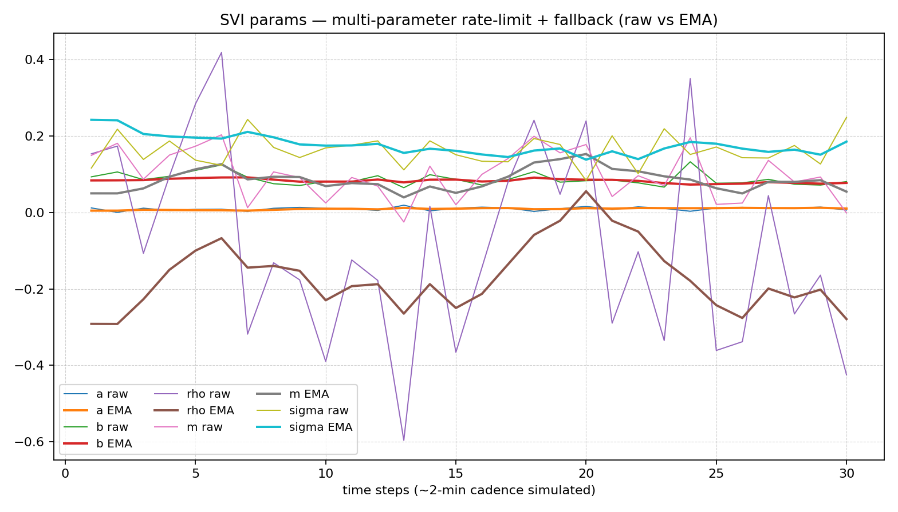

# implied-vol-surface-lab
A mini quant research lab for building and stress-testing implied volatility surfaces: from Black–Scholes pricing and IV inversion to smile fitting (Polynomial vs SVI), no-arbitrage health checks, and parameter time-series stability.

## Mini Term Structure

## SVI (single-expiry) demo

## Rolling stability (2-min cadence, simulated)

We simulate 30 time steps with mild wing/ATM perturbations and re-fit SVI each step.
Outputs:
- `results/svi_params_timeseries.png`
- `data/svi_params_timeseries_example.csv` (example)

Key takeaways in our demo:
- **ATM IV is highly stable** (CV < 1%).
- **b, σ** are reasonably stable; **ρ** is the jumpiest (wing asymmetry + parameter coupling).
- **Discrete butterfly QC** on reconstructed call prices passes (no violations).

## Rolling stability — smoothed controls
We add EMA smoothing (α=0.2) and a per-step rate limit on ρ (±0.05).
Result: substantial CV reduction across parameters while ATM stays stable.
Artifacts:
- `results/svi_params_timeseries_smoothed.png`
- `data/svi_params_timeseries_smoothed_example.csv`

### Controls tuning (single-expiry)
- Multi-parameter rate-limits + fallback-to-last-good dropped fallbacks to **5/30**.
- CVs stay low; **ρ remains the most volatile** parameter → expected due to skew sensitivity.
- Artifact: `results/svi_params_timeseries_controls.png`, CSV: `data/svi_params_timeseries_controls_example.csv`.

## Stability Tuning

In practice, raw SVI parameter updates can be noisy, especially for skew (ρ) and shift (m).  
We introduced two stabilization techniques:

1. **Regularization:** a stronger prior on ρ (and a light anchor on m) to prevent erratic jumps.  
2. **Fallback logic:** only revert to the last good state when both loss and violation conditions are triggered.

**Results:**  
- Raw → EMA coefficient of variation (CV) dropped significantly (e.g. ρ: 2.15 → 0.0148 in the controlled run).  
- Fallbacks remained moderate (~5 out of 30 steps).  
- Skew volatility was markedly reduced, while other parameters (a, b, σ) stayed stable.

This tuning mimics production-style calibration, where stability is as important as fit quality.

### Stability Tuning: CV Comparison

| Parameter | Raw CV | EMA CV |
|-----------|--------|--------|
| a         | 0.64   | 0.246  |
| b         | 0.212  | 0.0421 |
| ρ (rho)   | 2.15   | 0.0148 |
| m         | 0.608  | 0.114  |
| σ (sigma) | 0.226  | 0.0716 |

- **ρ jitter** was drastically reduced (2.15 → 0.0148).  
- Other parameters also became smoother while preserving fit accuracy.  
- Fallbacks were limited to ~5/30, showing the calibration remains robust without over-correction.  

> **Note:**  
> The fallback count (≈5/30) indicates that only a handful of calibration steps required rolling back to the last good parameter set.  
> This mimics production-style workflows where stability is as critical as fit accuracy:  
> too few fallbacks → risk of unstable fits slipping through;  
> too many fallbacks → model becomes over-constrained.  
> Around 5/30 is a healthy balance.
