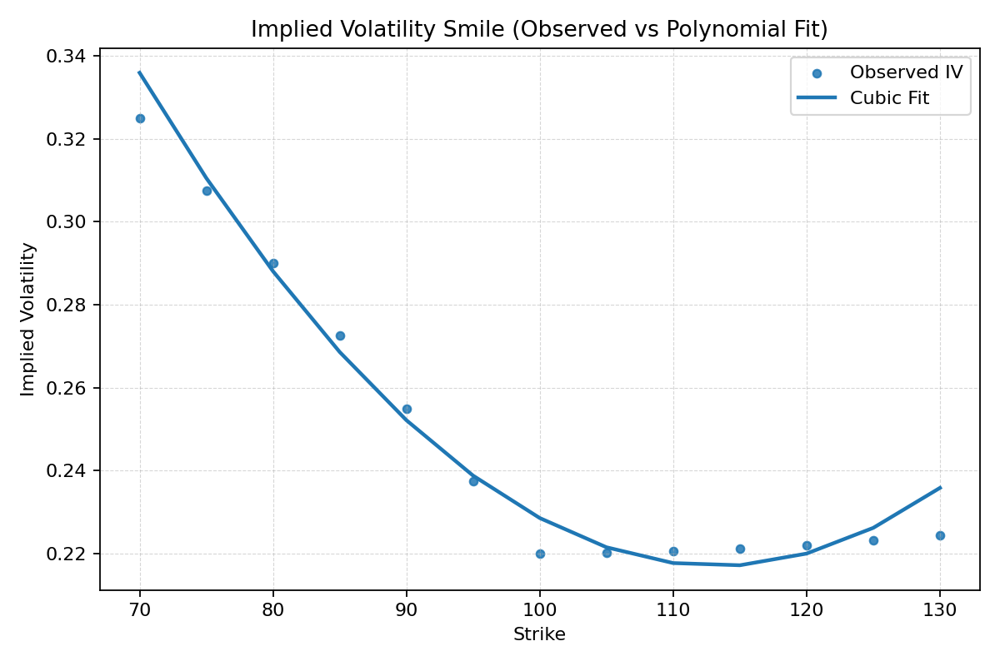
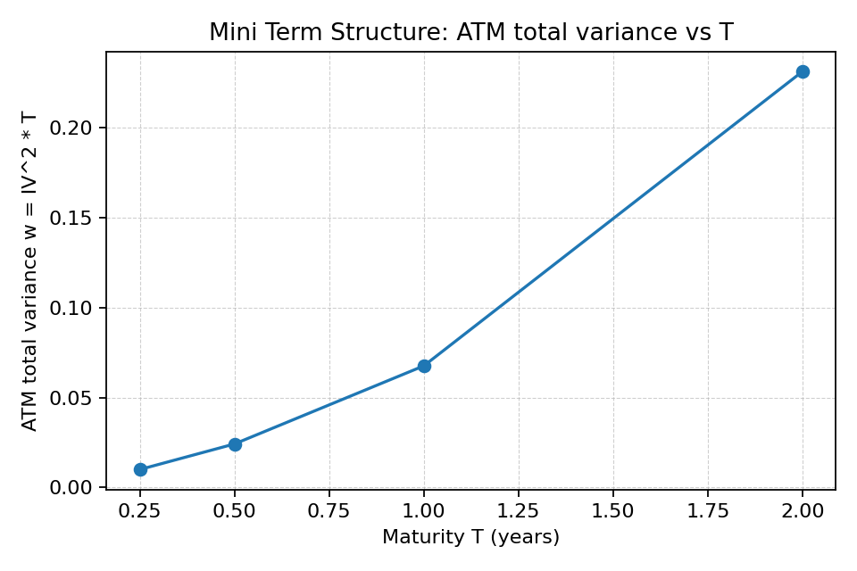
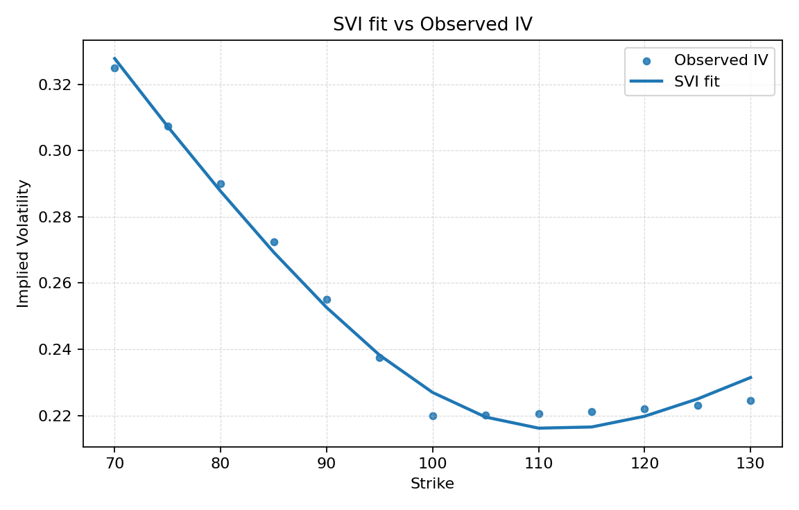

# implied-vol-surface-lab
A mini quant research lab for building and stress-testing implied volatility surfaces: from Black–Scholes pricing and IV inversion to smile fitting (Polynomial vs SVI), no-arbitrage health checks, and parameter time-series stability.

## Mini Term Structure

## SVI (single-expiry) demo

## Rolling stability (2-min cadence, simulated)

We simulate 30 time steps with mild wing/ATM perturbations and re-fit SVI each step.
Outputs:
- `results/svi_params_timeseries.png`
- `data/svi_params_timeseries_example.csv` (example)

Key takeaways in our demo:
- **ATM IV is highly stable** (CV < 1%).
- **b, σ** are reasonably stable; **ρ** is the jumpiest (wing asymmetry + parameter coupling).
- **Discrete butterfly QC** on reconstructed call prices passes (no violations).

## Rolling stability — smoothed controls
We add EMA smoothing (α=0.2) and a per-step rate limit on ρ (±0.05).
Result: substantial CV reduction across parameters while ATM stays stable.
Artifacts:
- `results/svi_params_timeseries_smoothed.png`
- `data/svi_params_timeseries_smoothed_example.csv`

### Controls tuning (single-expiry)
- Multi-parameter rate-limits + fallback-to-last-good dropped fallbacks to **5/30**.
- CVs stay low; **ρ remains the most volatile** parameter → expected due to skew sensitivity.
- Artifact: `results/svi_params_timeseries_controls.png`, CSV: `data/svi_params_timeseries_controls_example.csv`.
